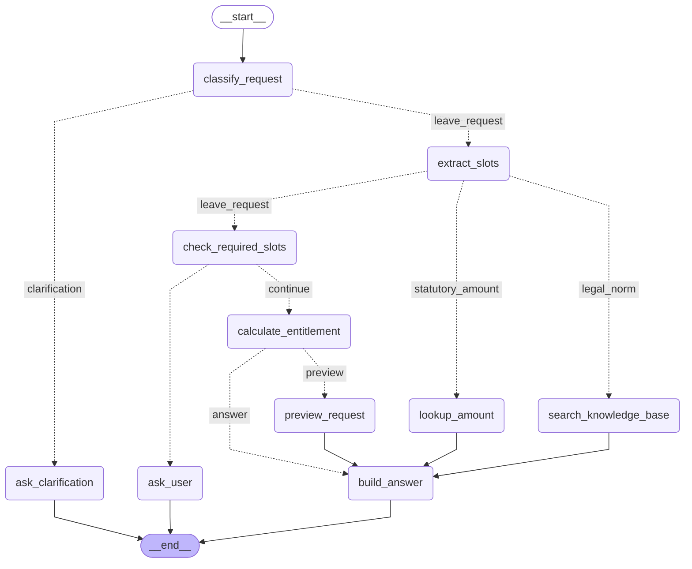

# Трасування LangGraph workflow

Той самий workflow, що в ДЗ №6, перенесений на LangGraph. Правила маршрутизації, витяг слотів, інструменти й шаблони відповідей імпортовані з `agent_flow.py` — змінилась **лише оркестрація**.

Згенеровано: 2026-09-02 · відтворюється командою `python scripts/run_langgraph.py`

## Граф

Діаграма згенерована самим фреймворком (`APP.get_graph().draw_mermaid()`) — вона не намальована вручну, тому не може розійтися з кодом.



---

## 1. Яка зараз мінімальна заробітна плата?

*Перевіряє: проста гілка: один інструмент, три вузли*

```
Input: Яка зараз мінімальна заробітна плата?
Route: statutory_amount
  reason: збіг за ключем «мінімальна заробітна плата» → Конкретна сума у гривнях із державного довідника
Nodes executed: classify_request -> extract_slots -> lookup_amount -> build_answer

Tool: get_statutory_amount
  Input: {"indicator": "minimum_wage_monthly", "on_date": null}
  Result: {"indicator": "minimum_wage_monthly", "label": "Мінімальна заробітна плата
          (місячна)", "value": 8647, "unit": "UAH/month", "effective_from": "2026-01-01",
          "effective_to": null, "on_date": "2026-09-02", "legal_basis": "Стаття 3 Закону
          України «Про оплату праці»; розмір встановлюється Законом про Держбюджет",

Final state:
  {
    "user_question": "Яка зараз мінімальна заробітна плата?",
    "selected_route": "statutory_amount",
    "slots": {
      "indicator": "minimum_wage_monthly"
    },
    "nodes_executed": [
      "classify_request",
      "extract_slots",
      "lookup_amount",
      "build_answer"
    ],
    "needs_user_input": null
  }

Final answer:
Мінімальна заробітна плата (місячна) станом на 2026-09-02 — 8647 UAH/month.
Діє з 2026-01-01. Підстава: Стаття 3 Закону України «Про оплату праці»; розмір
встановлюється Законом про Держбюджет.
[get_statutory_amount]
Увага: значення демонстраційне і не звірене з чинним Законом про Держбюджет.
```

---

## 2. Скільки днів щорічної відпустки належить за законом?

*Перевіряє: гілка бази знань — тут інструмент не потрібен*

```
Input: Скільки днів щорічної відпустки належить за законом?
Route: legal_norm
  reason: збіг за ключем «закон» → Норма права — відповідає база знань
Nodes executed: classify_request -> extract_slots -> search_knowledge_base -> build_answer

Tool: search_knowledge_base
  Input: {"query": "Скільки днів щорічної відпустки належить за законом?"}
  Result: {"source": "faiss_index", "chunks": [{"chunk_id": "zakon_pro_vidpustky_chunk_0055",
          "score": 0.879, "section": "Стаття 19-1. Відпустка при народженні дитини",
          "source_file": "data/raw/zakon_pro_vidpustky.html", "text": "для державної
          реєстрації народження дитини, або свідоцтва про народження дитини протягом 30

Final state:
  {
    "user_question": "Скільки днів щорічної відпустки належить за законом?",
    "selected_route": "legal_norm",
    "slots": {},
    "nodes_executed": [
      "classify_request",
      "extract_slots",
      "search_knowledge_base",
      "build_answer"
    ],
    "needs_user_input": null
  }

Final answer:
для державної реєстрації народження дитини, або свідоцтва про народження дитини
протягом 30 календарних днів з дня виходу в таку відпустку. Порядок надання відпустки
при народженні дитини встановлюється Кабінетом Міністрів України. Тривалість відпустки
у зв'язку з вагітністю та пологами обчислюється сумарно і становить 126 календарних
днів (140 календарних днів - у разі народження двох і більше ді

[Стаття 19-1. Відпустка при народженні дитини, zakon_pro_vidpustky_chunk_0055]
Джерело: data/raw/zakon_pro_vidpustky.html
```

---

## 3. Подай заявку на відпустку для emp_001 з 01.10.2026 на 10 днів

*Перевіряє: найдовший шлях: шість вузлів, два інструменти, стан між ними*

```
Input: Подай заявку на відпустку для emp_001 з 01.10.2026 на 10 днів
Route: leave_request
  reason: збіг за ключем «подай заявку» → Подання заявки на відпустку — дія, що змінює дані
Nodes executed: classify_request -> extract_slots -> check_required_slots -> calculate_entitlement -> preview_request -> build_answer

Tool: calculate_vacation_entitlement
  Input: {"employment_start_date": "2023-03-15", "as_of_date": "2026-10-01"}
  Result: {"employment_start_date": "2023-03-15", "as_of_date": "2026-10-01", "days_worked":
          1296, "months_worked": 43, "annual_days": 24, "accrued_days": 24, "used_days": 0,
          "remaining_days": 24, "eligible_for_full_leave": true, "legal_basis": "Стаття 6
          Закону «Про відпустки» — тривалість; стаття 10 — право на повну відпустку після

Tool: submit_leave_request
  Input: {"employee_id": "emp_001", "start_date": "2026-10-01", "days": 10, "confirmed": false}
  Result: {"employee_id": "emp_001", "employee_name": "Олена Ткаченко", "start_date":
          "2026-10-01", "days": 10, "accrued_days_at_start": 24, "exceeds_accrued": false,
          "status": "requires_confirmation", "written": false, "message": "Це дія, що змінює
          дані. Покажи користувачу ці параметри й виклич інструмент повторно з confirmed=true

Final state:
  {
    "user_question": "Подай заявку на відпустку для emp_001 з 01.10.2026 на 10 днів",
    "selected_route": "leave_request",
    "slots": {
      "employee_id": "emp_001",
      "dates": [
        "2026-10-01"
      ],
      "days": 10
    },
    "nodes_executed": [
      "classify_request",
      "extract_slots",
      "check_required_slots",
      "calculate_entitlement",
      "preview_request",
      "build_answer"
    ],
    "needs_user_input": "Підтвердіть подання заявки."
  }

Final answer:
Готую заявку: Олена Ткаченко (emp_001), з 2026-10-01 на 10 днів. Накопичено на цю
дату: 24 днів.
Заявку ще НЕ подано — підтвердіть, і я її надішлю.
[submit_leave_request, status=requires_confirmation]
```

---

## 4. Хочу подати заявку на відпустку

*Перевіряє: другий conditional edge: слотів бракує → ask_user*

```
Input: Хочу подати заявку на відпустку
Route: leave_request
  reason: збіг за ключем «подати заявку» → Подання заявки на відпустку — дія, що змінює дані
Nodes executed: classify_request -> extract_slots -> check_required_slots -> ask_user

Final state:
  {
    "user_question": "Хочу подати заявку на відпустку",
    "selected_route": "leave_request",
    "slots": {},
    "nodes_executed": [
      "classify_request",
      "extract_slots",
      "check_required_slots",
      "ask_user"
    ],
    "needs_user_input": "Щоб продовжити, вкажіть, будь ласка, ідентифікатор працівника у форматі emp_001."
  }

Final answer:
Щоб продовжити, вкажіть, будь ласка, ідентифікатор працівника у форматі emp_001.
```

---

## 5. Розкажи щось цікаве

*Перевіряє: перший conditional edge веде повз усі гілки*

```
Input: Розкажи щось цікаве
Route: clarification
  reason: жодне правило не спрацювало
Nodes executed: classify_request -> ask_clarification

Final state:
  {
    "user_question": "Розкажи щось цікаве",
    "selected_route": "clarification",
    "slots": {},
    "nodes_executed": [
      "classify_request",
      "ask_clarification"
    ],
    "needs_user_input": "Уточніть, будь ласка: вас цікавить норма закону, конкретна сума (мінімальна зарплата, прожитковий мінімум), розрахунок вашої відпустки чи подання заявки?"
  }

Final answer:
Уточніть, будь ласка: вас цікавить норма закону, конкретна сума (мінімальна зарплата,
прожитковий мінімум), розрахунок вашої відпустки чи подання заявки?
```

---
